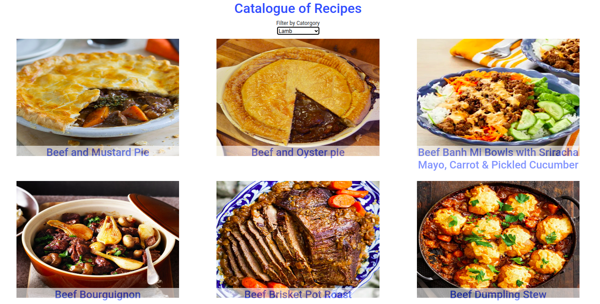

## Catalogue of Recipes

In this project, I built a fast and dynamic catalogue of recipes using react/redux, axios, promises etc.
- `Recipes page` with a list of recipes that could be filtered by some parameters; in this project, it's a list of recipes that can be filtered by ingredients (shrimp, broccoli, etc.)
- `Recipe details page` for the recipe details; in this example, the recipe detail page (Preview Recipe)

## Tools To Work With

- Node.js
- React
- React-DOM
- React-Create-App
- npm
- React
- Redux
- React-Redux
- Prop-Types
- Jest
- Redux-thunk
- Enzyme
- Axios
- Styled-Components
- Thunk
- Heroku

## Deployment

- ``` heroku create $APP_NAME --buildpack mars/create-react-app```
- ``` git push heroku milestone1:master ```
- ` heroku open `

## Screenshot


## Live Demo

[Live Demo Link](https://redux-recipe.herokuapp.com/)

## Video Presentation

[Presentation](https://www.loom.com/share/e143ea99b74a466b815796488614431e)

[Presentation 2](https://www.loom.com/share/0b3b3d51f2fd434eb81ac143eb2befa1)

## Getting Started

To get a local copy up and running follow these simple example steps.

1. ``` git clone https://github.com/addod19/redux_recipe.git ```
2. ``` cd redux_recipe ```
3. ``` npm install ```
4. ``` npm start ```

## To Run Test

1. ` npm test `

## To Check for Linter Errors

1. ` npx stylelint "**/*.scss" ` for stylelint
2. ` npm eslint . ` for eslint


This project was bootstrapped with [Create React App](https://github.com/facebook/create-react-app).


### Prerequisites

- A modern browser
- Text editor

## Authors

👤 **Daniel Larbi Addo**

- Github: [@addod19](https://github.com/addod19)
- Twitter: [@DanielLarbiAdd1](https://twitter.com/DanielLarbiAdd1)
- Linkedin: [Daniel Larbi Addo](https://linkedin.com/in/daniel-larbi-addo/)
- Email: (addodaniellarbi@gmail.com)

## 🤝 Contributing

Contributions, issues and feature requests are welcome!

Feel free to check the [issues page](https://github.com/addod19/redux_recipe/issues).


1. Fork it (https://github.com/addod19/redux_recipe/fork)
2. Create your feature branch (git checkout -b my-new-feature)
3. Commit your changes (git commit -am 'Add some feature')
4. Push to the branch (git push origin my-new-feature)
5. Create a new Pull Request

## Show your support

Give a ⭐️ if you like this project!

## Acknowledgments

- MIcroverse
- Microverse TSE's

## 📝 License

This project is [Apache](lic.url) licensed.
